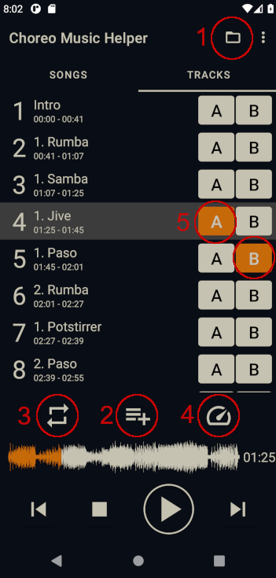

# Choreo Music Helper

## Description

*What is this app NOT?*

This app is not a full music library to manage hundreds of songs. If you want this, search for another app.

*What is this app then?*

The Choreo Music Helper is an Android app to support everyone, who wants to perform to a specific song. In those cases, the user(s) normally needs to train very often to one specific song or even small part of the track.

Therefore the Choreo Music Helper allows the user to split the song into smaller tracks, which can be looped, have some lead-in/-out time to prepare for the next iteration and change the speed.

For this requirement only a handful of songs should be added to the App, so you don't have to search long during a training session.

## Features

* Split a song fast and easy into multiple smaller tracks
* Loop one or multiple tracks
* Change speed
* Configure lead-in and -out time for a loop
* Save the track information in an .MP3 file of the song to share it
* Configure track starting position exactly when editing a track

## Introduction

1. Open a file with button **1**
2. Play the file and at every part, where a new track should start, press button **2**, a new track will appear
3. Configure lead-in and lead-out time via button **3**
4. Change the speed via button **4**
5. Set the tracks which should be looped with the A- (start) and B-Buttons (end) marked with **5**

## Notes

* A track is always defined only with it's start time in the song and ends when the next track starts. Therefore, if you add a new track the end time of the track before will change.
* The lead-in time also applies when you click on a track to play it. E.g. if you have a lead-in time of 10 seconds and click on a track starting at 1:25, the progress bar jumps to 1:15.
* As soon as you have **A** and **B** set, a loop is configured and only the loop will be played. To cancel a loop, deactivate either **A** or **B**
* Currently, only .MP3 files are supported.

## Install

Currently install is only possible via a self made build, which then can be installed. I'm working on getting it published to Google Play Store and F-Droid

## Support me

As this is a free project which I build mostly to use for myself, I'm happy about anybody who wants to use it. However, if you like the App and would like to give something back, here is a link: 

Independently from any donations I'll try to update and improve the App whenever I have some time and the best way to support me in it is to give me feedback. So open an [issue](https://github.com/yoadey/choreomusic/issues/new) whenever you miss something or something is not working on your device.